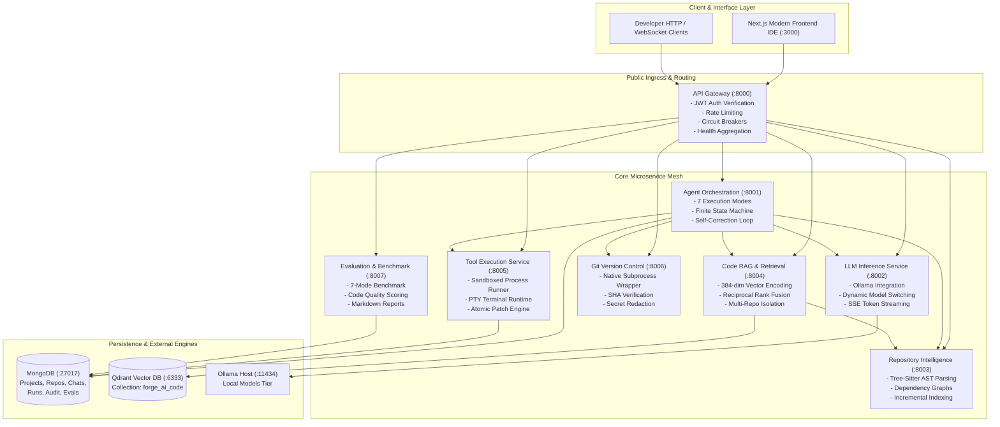
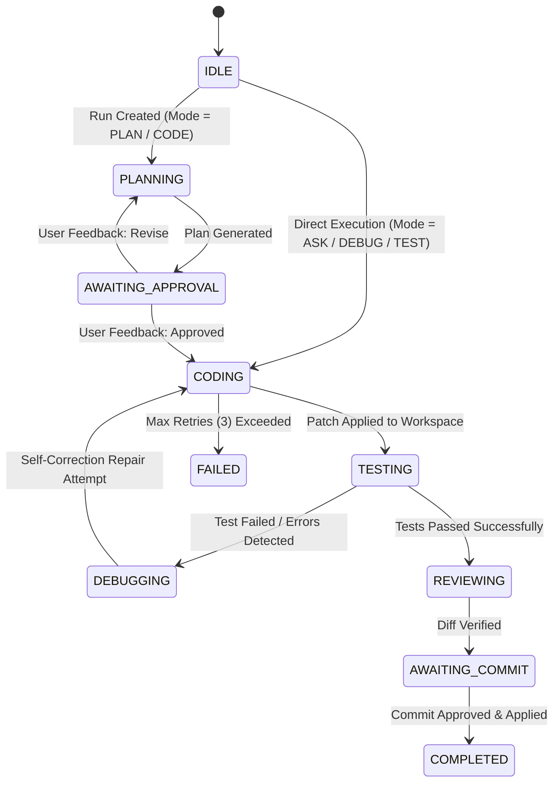

# ForgeAI — Autonomous Local AI Software Engineering Platform

[](https://fastapi.tiangolo.com)
[](https://www.python.org/)
[](https://nextjs.org/)
[](https://qdrant.tech/)
[](https://www.mongodb.com/)
[](https://www.docker.com/)

ForgeAI is a production-grade, local-first autonomous software engineering monorepo platform. It integrates deep **Repository Intelligence**, **Hybrid Code RAG**, **7-Mode Agent Orchestration**, **Sandboxed Tool Execution**, **Interactive PTY Terminals**, **Git Version Control**, and an **Automated Benchmarking Suite** into an 8-microservice distributed architecture.

---

## 1. System Architecture & Topology

ForgeAI is structured as an 8-microservice backend coordinated through a single public API Gateway with dedicated persistence in MongoDB and Qdrant Vector Database.



---

## 2. Microservices Reference Matrix

Every microservice exposes full interactive OpenAPI specifications (`/docs`, `/redoc`, `/openapi.json`):

| Service | Port | Description | Primary Responsibilities |
| :--- | :--- | :--- | :--- |
| **`api-gateway`** | `8000` | Public API Gateway & Reverse Proxy | JWT authentication, rate limiting, request forwarding, circuit breakers, health aggregation. |
| **`agent-service`** | `8001` | Cognitive Agent Orchestrator | 7 operational modes, Finite State Machine, DAG planning, self-correction repair loops. |
| **`llm-service`** | `8002` | Local LLM Inference Engine | Ollama runtime interface, model switching, fallback circuit breakers, token estimation. |
| **`repository-service`** | `8003` | Codebase & AST Intelligence | Tree-Sitter multi-language symbol extraction, dependency graph builder, file trees. |
| **`retrieval-service`** | `8004` | Code Vector RAG Engine | Qdrant vector indexing (384-dim), hybrid search, Reciprocal Rank Fusion (RRF) reranking. |
| **`tool-service`** | `8005` | Sandboxed Tool Execution | `SecuritySandbox`, PTY terminal WebSocket backend, pytest runner, atomic patch rollback. |
| **`git-service`** | `8006` | Git & Version Control | Git branching, staging, atomic commit creation, diff inspection, credential redaction. |
| **`evaluation-service`** | `8007` | Benchmark & Quality Suite | 7-mode benchmark engine, automated code scoring (accuracy, syntax, latency), reports. |

---

## 3. The 7 Autonomous Agent Execution Modes

The Agent Service (`forge_agent`) operates on an auditable **Finite State Machine (FSM)** supporting 7 distinct execution modes:



| Mode | Objective | Plan Required | Permitted Tools & Capabilities |
| :--- | :--- | :---: | :--- |
| **`ASK`** | Direct architectural Q&A and code explanation | No | Read files, AST symbol search, semantic retrieval |
| **`PLAN`** | Complex architectural task decomposition | Yes | Repository scanner, dependency analysis, DAG planner |
| **`CODE`** | Full feature implementation | Yes | Read, write, multi-file patch, test runners, linters |
| **`DEBUG`** | Bug diagnosis and targeted remediation | Optional | Pytest runner, stack trace inspection, surgical patch |
| **`TEST`** | Automated unit & integration test generation | No | Pytest test generator, test runner, assertion validator |
| **`REVIEW`** | Forensic security and quality code review | No | Git diff analyzer, AST linter, static analysis |
| **`EXPLAIN`** | Deep algorithm and codebase walkthrough | No | AST symbol lookup, architecture mapping |

---

## 4. Code RAG & Hybrid Vector Retrieval Pipeline

ForgeAI indexes source code repositories into **Qdrant Vector Database** (`collection: forge_ai_code`):

- **Vector Dimension**: `384` dense float32 vectors (`Cosine` distance).
- **Embedding Models**: Local `BAAI/bge-small-en-v1.5` or `sentence-transformers/all-MiniLM-L6-v2`.
- **AST Chunk Metadata**: Each point contains `file_path`, `language`, `symbol`, `symbol_type`, `start_line`, `end_line`, `chunk_hash`, `git_commit`, and static dependency links.
- **Multi-Signal Hybrid Search & RRF**:
  Combines Semantic Vector Search, AST Symbol Lookup, Keyword Matching, and Dependency Graph Traversal using Reciprocal Rank Fusion:
  $$RRF(d) = \sum_{m \in M} \frac{w_m}{60 + r_m(d)}$$
- **Multi-Repository Isolation**: Hard filtering on `repository_id` guarantees 0 cross-contamination between repositories.
- **Context Window Management**: Dynamic token budgeting enforces hard ceiling token bounds on LLM context prompts.

---

## 5. Security Architecture & Threat Model

ForgeAI implements **Defense-in-Depth** security:

1. **Authentication & Identity**:
   - Public Gateway routes require signed HMAC-SHA256 Bearer JWTs (`Authorization: Bearer <token>`).
   - Internal microservice-to-microservice traffic is signed with timestamped HMAC tokens (`X-Internal-Service-Token`) with replay attack protection (300s window).
2. **Path Traversal Containment (`SecuritySandbox`)**:
   - All filesystem operations resolve canonical symlink-dereferenced paths.
   - Escape vectors (`../`, `..\\`, null bytes, drive switching, system directories) trigger `UnauthorizedException`.
3. **Atomic Patch Engine Rollback**:
   - Multi-file patch modifications create pre-patch backup snapshots in memory. If any file fails validation or syntax checks, all files are automatically rolled back to their original state.
4. **Credential Redaction Protocol**:
   - All logs, error traces, diffs, and benchmark reports enforce a mandatory redaction filter. Tokens and keys are masked as `[REDACTED]`.

---

## 6. Monorepo Directory Structure

```
forge-ai/
├── services/                     # Core FastAPI Microservices
│   ├── gateway/                  # API Gateway (:8000)
│   ├── agent/                    # Autonomous Agent Orchestrator (:8001)
│   ├── llm/                      # Local LLM & Ollama Service (:8002)
│   ├── repository/               # Repository Intelligence & AST Parser (:8003)
│   ├── retrieval/                # Qdrant Vector RAG Service (:8004)
│   ├── tools/                    # Sandboxed Process & Terminal Tools (:8005)
│   ├── git/                      # Git Operations Service (:8006)
│   └── evaluation/               # Benchmarking & Metrics Service (:8007)
├── shared/                       # Monorepo Core Infrastructure
│   ├── config/                   # Typed Pydantic Settings
│   ├── logging/                  # Loguru Request-Context Logger
│   ├── middleware/               # Auth, Logging, Rate Limiting, CORS
│   ├── exceptions/               # Standardized Error Handling
│   ├── schemas/                  # Standard Response Envelopes
│   └── utils/                    # Microservice Application Factory
├── frontend/                     # Next.js 15 Web IDE
│   ├── src/app/                  # App Router & Main Workspace
│   ├── src/components/           # Terminal, Monaco Editor, Agent Chat
│   └── src/lib/api/              # Gateway & WebSocket Clients
├── tests/                        # 188+ Master Test Suite
├── docs/                         # Technical Architecture Documentation
│   ├── models.md                 # LLM Architecture & Model Switching
│   ├── rag.md                    # Vector Retrieval & Indexing Pipeline
│   ├── agent.md                  # 7 Agent Modes & State Machine
│   ├── api.md                    # Master API Reference & Swagger Matrix
│   ├── security.md               # Threat Model & Sandboxing
│   ├── evaluation.md             # Benchmark Suite & Scoring Formulas
│   └── architecture.md           # Distributed Topology & Network
├── docker-compose.yml            # Complete Container Orchestration
└── pyproject.toml                # Monorepo Dependencies & Tooling
```

---

## 7. Quickstart & Deployment

### Prerequisites
- **Python**: 3.12+
- **Docker & Docker Compose**: 24.0+
- **Node.js**: 18+ (for frontend development)
- **Ollama**: (Optional for local inference, models: `qwen2.5-coder:7b-instruct-q4_0`, `qwen2.5-coder:3b-instruct-q4_0`)

### 1. Launch Backend Infrastructure (Docker Compose)
```bash
# Clone the repository
git clone https://github.com/imSaurav06/ForgeAI.git
cd ForgeAI

# Copy environment configuration
cp .env.example .env

# Start all 8 microservices, MongoDB, and Qdrant
docker compose up -d
```

### 2. Verify Services Health
```bash
# Direct Gateway Health Check
curl http://localhost:8000/health

# Aggregated 8-Microservice Health
curl http://localhost:8000/api/v1/health/aggregate
```

### 3. Launch Frontend IDE
```bash
cd frontend
npm install
npm run dev
# Open http://localhost:3000 in your browser
```

### 4. Run Test Suite
```bash
# Execute complete monorepo regression suite (188+ tests)
pytest -v
```

---

## 8. Master Certification Status

ForgeAI is certified under the **Strict Double Execution Protocol** across all 8 phases with **100% test pass rate** (188 Passed, 0 Failed). Complete verification details are documented in [FINAL_ASSIGNMENT_CERTIFICATION.md](FINAL_ASSIGNMENT_CERTIFICATION.md) and [docs/](docs/).
