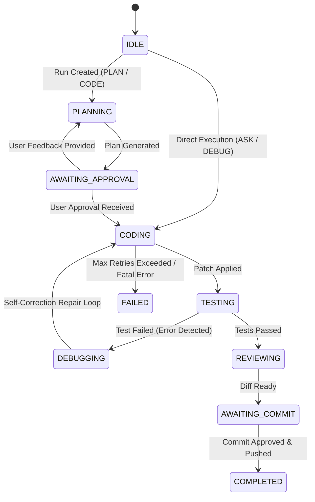

# ForgeAI — Autonomous Agent Architecture

## Overview
The **Agent Service** (`forge_agent`, port `8001`) is the core cognitive orchestrator of the ForgeAI platform. It executes multi-step autonomous software engineering workflows across 7 operational modes, managing planning, tool dispatching, code generation, testing, self-correction repair loops, and git patch application.

---

## 1. The 7 Operational Modes

| Mode | Objective | Plan Required | Allowed Actions |
| :--- | :--- | :--- | :--- |
| **`ASK`** | Direct Q&A and code explanation | No | Read files, AST search, semantic retrieval |
| **`PLAN`** | Architectural decomposition & task breakdown | Yes | Repository scan, dependency graph, DAG task planning |
| **`CODE`** | Full-scale feature development | Yes | Read, write, patch, test runner, linter |
| **`DEBUG`** | Bug diagnosis and patch verification | No / Optional | Test execution, log inspection, targeted patching |
| **`TEST`** | Automated unit and integration test generation | No | Test runner, pytest execution, assertion patching |
| **`REVIEW`** | Forensic code and security review | No | Diff analysis, static analysis, linter |
| **`EXPLAIN`** | Deep codebase and algorithm explanation | No | AST symbol lookup, architecture mapping |

---

## 2. Finite State Machine (FSM)

The agent operates on an explicit, auditable State Machine:

---

## 3. Self-Correction & Repair Loop

When generated code causes syntax errors, test failures, or lint violations:
1. The **Diagnostic Engine** captures stdout/stderr and error line numbers.
2. The agent transitions to `DEBUGGING` state.
3. The prompt is augmented with the exact stack trace and failing test assertion.
4. Up to 3 autonomous repair attempts are executed before requesting user intervention.
5. If unrecoverable, the **Patch Engine** executes atomic rollback, leaving the working directory completely clean.

---

## 4. Real-time Event Streaming (SSE) & WebSockets

- **Server-Sent Events (SSE)**: `GET /api/v1/agent/runs/{run_id}/stream` delivers live execution events (`agent.started`, `plan.generated`, `tool.dispatched`, `test.executed`, `run.completed`).
- **WebSockets**: `GET /api/v1/ws/agent/{run_id}` provides bidirectional real-time communication for interactive user confirmations.
