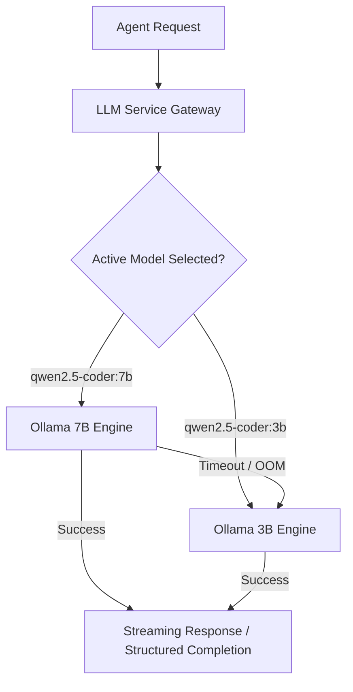

# ForgeAI — LLM Architecture & Model Management

## Overview
The **LLM Service** (`forge_llm`, port `8002`) provides a resilient, unified abstraction layer for local and cloud-based Large Language Models. Built on top of **Ollama** and high-throughput inference runtimes, the service handles structured code generation, model discovery, model switching, fallback execution, and token estimation.

---

## 1. Supported Models & Specialization

ForgeAI natively configures two primary local model tiers:

| Tier | Model Identifier | Parameters | Quantization | Primary Use Case |
| :--- | :--- | :--- | :--- | :--- |
| **Quality / Reasoning** | `qwen2.5-coder:7b-instruct-q4_0` | 7.61B | Q4_0 | Architecture decomposition, multi-file code generation, complex refactoring, security review |
| **Fast / Reactive** | `qwen2.5-coder:3b-instruct-q4_0` | 3.09B | Q4_0 | Code explanation, quick single-function edits, unit test generation, AST symbol docstringing |

---

## 2. Dynamic Model Switching & Fallback Resilience

The LLM service enforces strict fallback mechanisms:
- **Active Model Selection**: Clients can dynamically switch models via `POST /api/v1/models/select` without service interruption.
- **Circuit Breaker Fallback**: If the primary 7B model exceeds latency thresholds or experiences VRAM pressure, requests automatically degrade gracefully to the fast 3B model or structured offline rule generation.
- **Fail-Closed Validation**: Empty model names or unauthorized requests are rejected immediately with descriptive error responses.

---

## 3. Streaming SSE & Structured Patch Generation

ForgeAI supports real-time token delivery and structured patch generation:
- **Streaming Response**: Tokens are emitted via Server-Sent Events (`text/event-stream`) allowing immediate IDE visualization.
- **Structured Tool Calling**: Instructions are formatted with strict system prompts requesting JSON patch schemas (`files_to_create`, `files_to_modify`, `files_to_delete`) with regex boundary fences.
- **Token Estimation & Budgeting**: Strict token calculations (using `all-MiniLM-L6-v2` / BAAI embeddings and char-to-token estimators) prevent context window truncation.

---

## 4. API Endpoints Reference

- `GET /v1/models`: List all available models, quantization tiers, and availability status.
- `POST /v1/models/select`: Set global active model for coding workflows.
- `GET /v1/models/health`: Check Ollama connection status, VRAM allocation, and response latency.
- `POST /v1/llm/generate`: Synchronous structured code generation.
- `POST /v1/llm/stream`: Real-time token streaming endpoint.
